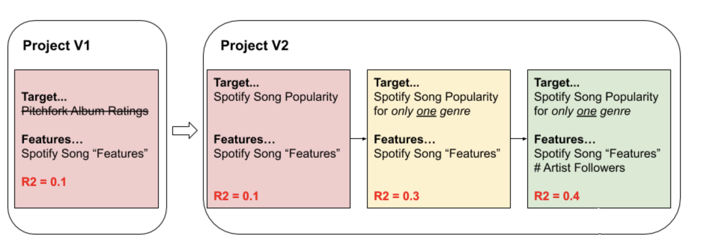

_Disclaimer: Much of this post assumes that the reader has some basic data science knowledge, as opposed to my 
[inaugural post](https://stephenjkaplan.github.io/2020/07/06/how-i-got-here/) which was a self-reflective, career 
oriented post._

I just completed the first major independent project during my time as a student at [Metis](https://thisismetis.com). 
We were given two weeks to complete a project that satisfied the following constraints:

* Train a model that predicts a continuous, numeric value using a mix of numerical and categorical data.
* The model must be fit using only linear regression, polynomial regression, or any regularization-enhanced variant of 
  linear regression (Lasso, Ridge, ElasticNet).
* At least a portion of the training data must be acquired via web-scraping.
* Use a relatively small training set (on the order of 100's or 1000's of records).

Generally, I enjoyed working through the full data science workflow for the first time and being able to go deep into a 
data set. This blog post aims to detail my process, from the initial search for data to deploying the model.

#### Motivation

My opinion going into my first project was that aside from all technical metrics, there are two determinants of a 
compelling personal portfolio project:

1. The project should use a topic/data set that excites you. That excitement and passion will come through in your work.
2. The project should not just produce "interesting" or "cool" results. The results should be actionable and carry 
   value. Your future hiring manager might like to see something that is fun, but they also most likely want to see 
   that you can make valuable predictions and/or interpretations with data.

As a [music producer](https://open.spotify.com/artist/5qdyMjUQjxhdWtKjHvh3cm?si=fIw0oAbfQgmo--fETANStA) and someone 
exploring the field of music technology as a potential career path, I felt compelled to search for music-related data. 
I find the field of music recommendation and personalization to be exciting. Reading the 
[Spotify Engineering blog](https://engineering.atspotify.com/) gave me the prior knowledge that they are on the cutting 
edge of music technology, and that they publish interesting, high-quality data sets on 
[their API](https://developer.spotify.com/documentation/web-api/). One particular Spotify data set that stood out to me 
contained 
["track audio features"](https://developer.spotify.com/documentation/web-api/reference/tracks/get-audio-features/). 
These data are generated by a proprietary algorithm for every track on the Spotify platform, and contain such features 
as "danceability", "energy", and "loudness". Most of these features are numerically encoded on a scale of 0 to 1. 

As far as yielding valuable conclusions, it seemed that the best way to apply this data was to predict the success of 
a song based on its various qualities, or to interpret the model by making recommendations on how to write a "hit". 
Choosing a target to predict that accomplished this goal took some time, but was a good lesson in selection of 
project scope.

#### Narrowing the Scope

The first thing that came to mind to predict was Pitchfork Album Ratings. [Pitchfork](https://pitchfork.com/) is 
arguably the most well-established music blog on the internet. The website's most prominent feature is its album reviews, 
each of which contain a written review and a rating, scored on a scale of 0 to 10. While these reviews have received 
heavy criticism and scrutiny, their stamp of approval has been credited with jump starting the successful music careers 
of artists like [Arcade Fire](https://pitchfork.com/reviews/albums/452-funeral/) and 
[Bon Iver](https://pitchfork.com/reviews/albums/10709-for-emma-forever-ago/). Surely, a good review on Pitchfork is a 
strong indicator of a successful album.

<small>The processing of choosing an appropriate project scope.</small>

#### Exploratory Analysis, Modeling, & Technicals

- a much more technical section
    - issues with data
    - modeling flow
    - scoring

#### Deploying the Model 

#### Interpretation

#### Lessons Learned

- lessons learned
    - the correlations of my model don't necessarily imply causation
    
    - scope